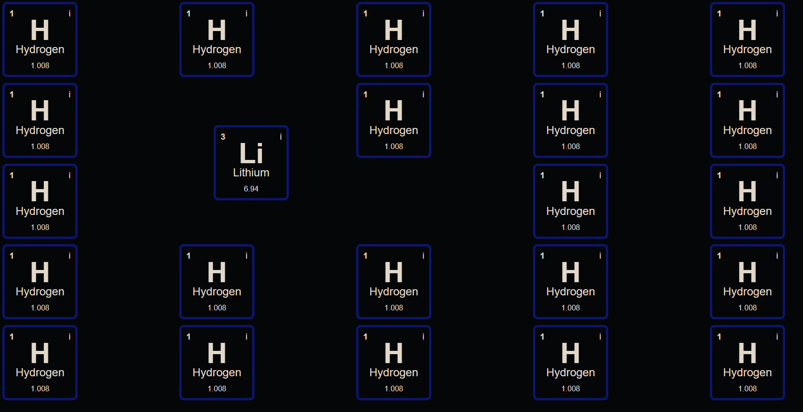

# Alchemy Game

This is a game where you can drag and drop elements to fuse them.
You can check it out [here](https://slienlaffa.github.io/alchemy).

## Description

One of the goals of alchemy was to create gold from other elements. If you could add atoms together like this in real life, the problem would be easy.

This is written in vanilla JavaScript, HTML, and CSS.

Tips: Double click an element to duplicate it.

How to install:

1. Clone the repository
2. `npm install` or `bun install`
3. `npm run dev` or `bun run dev`
4. Open `localhost:5173` in your browser or whatever port it gives you

The only reason you need to run a server is because of CORS, the data is in a json file. There are workarounds but this is simpler.

*Periodic table from: https://github.com/Bowserinator/Periodic-Table-JSON*